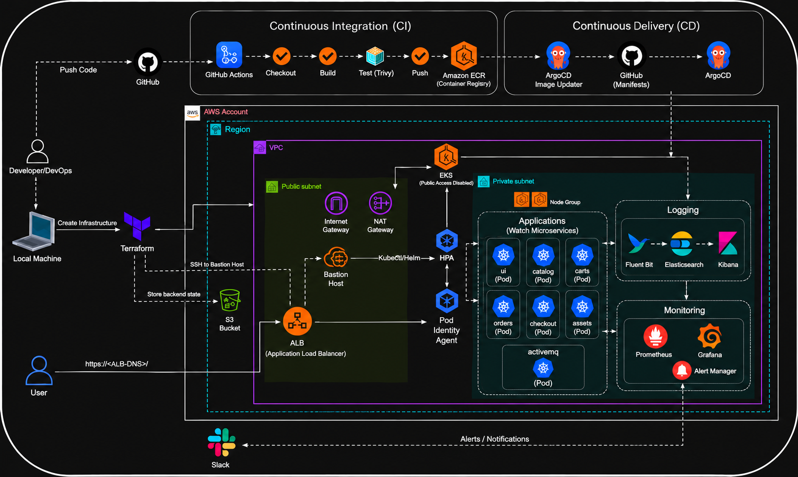
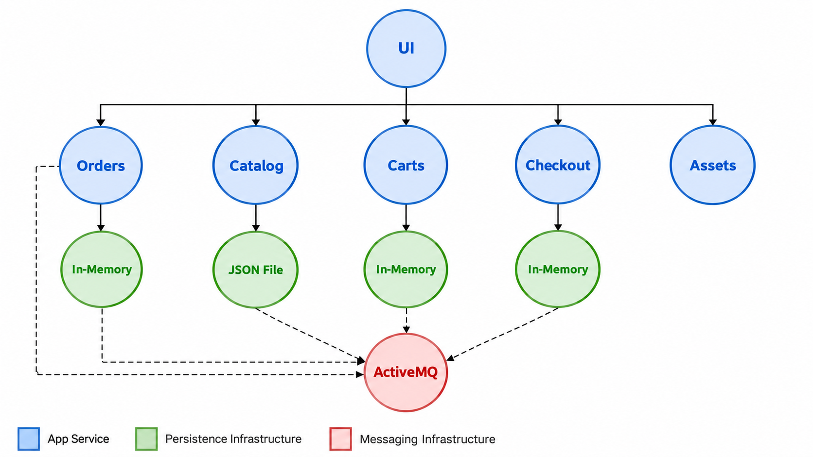
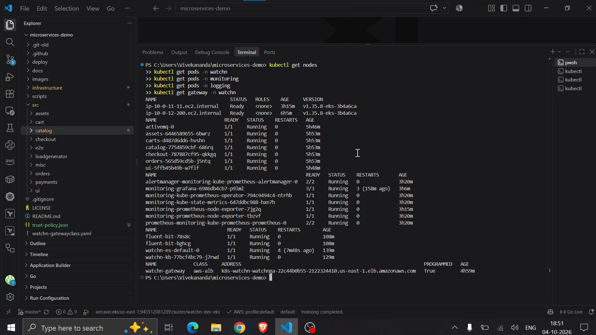
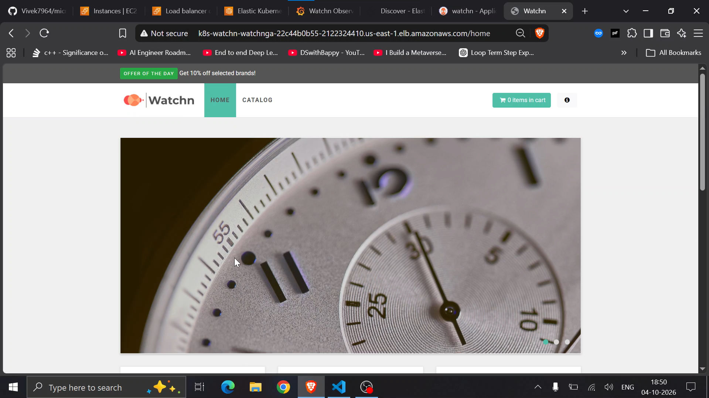
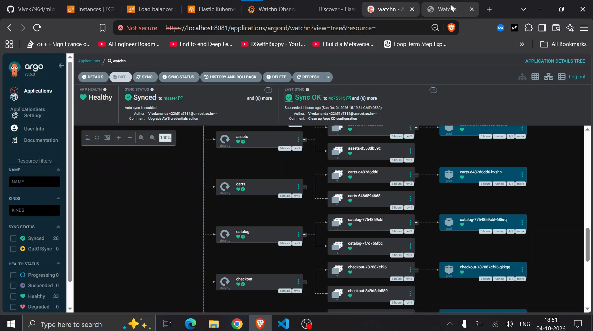
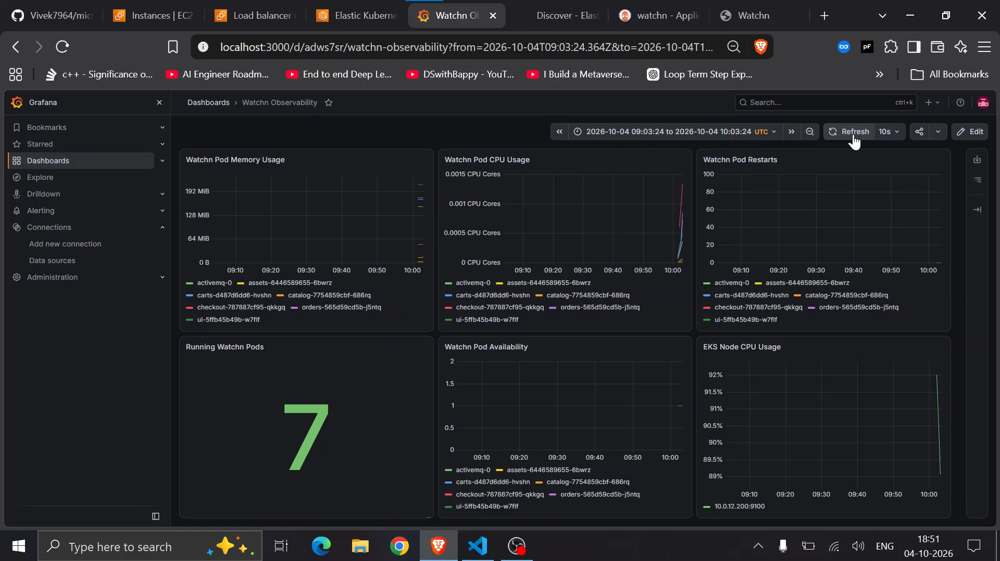
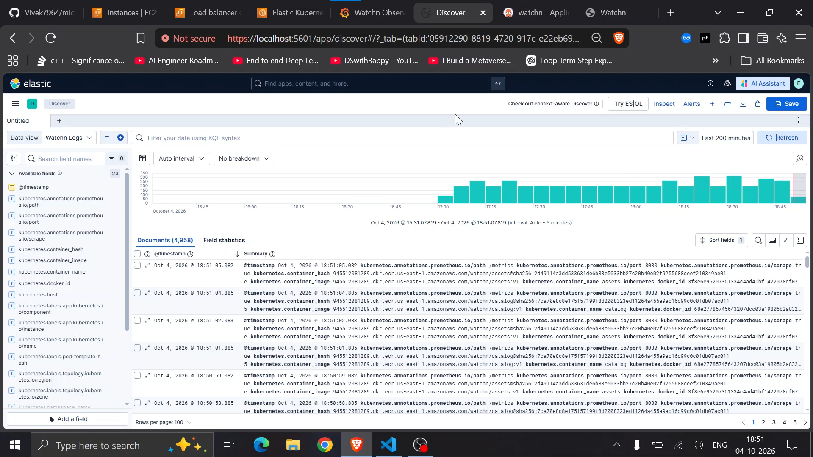

# 🚀 Watchn – Cloud-Native Microservices Platform

Watchn is a cloud-native microservices application modernized and deployed on Kubernetes and Amazon EKS. The application has been simplified by replacing unnecessary database dependencies with JSON-based and in-memory storage while retaining the core microservices architecture and ActiveMQ-based asynchronous communication. The platform integrates Docker, Terraform, Helm, Helmfile, Argo CD, Prometheus, Grafana, Fluent Bit, Elasticsearch, Kibana, and AWS services to demonstrate a complete cloud-native deployment workflow. 

The project focuses on practical Cloud and DevOps engineering, covering infrastructure, containerization, GitOps, monitoring, centralized logging, autoscaling, and Kubernetes operations.

---

## 🏗️ Architecture



The Watchn application is deployed as a collection of containerized microservices running on Kubernetes.

The platform uses:

- **Docker** for containerization
- **Kubernetes / Amazon EKS** for orchestration
- **Terraform** for AWS infrastructure
- **Helm / Helmfile** for application deployment
- **Argo CD** for GitOps
- **Prometheus / Grafana** for monitoring
- **Fluent Bit / Elasticsearch / Kibana** for centralized logging
- **ActiveMQ** for asynchronous messaging
- **AWS Application Load Balancer** for external access

---


# 🎥 Project Demo

Watch the complete project demonstration:


https://github.com/user-attachments/assets/fd82c8d4-b018-44ae-860f-a21a0f0000dc


---

## 🧩 Microservices Architecture



The application consists of the following services:

| Service | Responsibility | Storage |
|---|---|---|
| **Catalog** | Product catalog | `products.json` |
| **Carts** | Shopping carts | In-memory |
| **Orders** | Order management | In-memory |
| **Checkout** | Checkout processing | In-memory |
| **Assets** | Static/application assets | Stateless |
| **UI** | Frontend | Stateless |
| **ActiveMQ** | Asynchronous messaging | Message broker |

The architecture keeps the original microservice structure while simplifying unnecessary database dependencies.

---

# 💾 Simplified Storage Architecture

The original Watchn application depended on database infrastructure that was unnecessary for this project.

The storage layer was simplified to make the application lightweight and easier to deploy.

```text
                         Watchn
                           │
          ┌────────────────┼────────────────┐
          │                │                │
          ▼                ▼                ▼
       Catalog           Carts            Orders
          │                │                │
          ▼                ▼                ▼
   products.json       In-Memory        In-Memory


                      Checkout
                         │
                         ▼
                     In-Memory


                       Assets
                         │
                         ▼
                      Stateless
```

### Catalog

Product information is stored in:

```text
src/catalog/products.json
```

The Catalog service reads product information directly from the JSON file instead of using MySQL.

### Carts

Cart information is maintained using an in-memory data structure.

### Orders

Orders are maintained using an in-memory repository.

### Checkout

Checkout processing uses an in-memory repository instead of Redis.

### Assets

The Assets service remains stateless.

### ActiveMQ

ActiveMQ is retained as the messaging layer for asynchronous communication between services.

---

# 🐳 Running Locally

## Prerequisites

- Docker
- Docker Compose
- Git

### Clone the repository

```bash
git clone https://github.com/Vivek7964/microservice-demo.git
cd microservice-demo
```

### Start the application

```bash
cd deploy/docker-compose
docker compose up -d
```

### Check containers

```bash
docker compose ps
```

### View logs

```bash
docker compose logs -f
```

### Stop the application

```bash
docker compose down
```

---

# ☸️ Kubernetes Deployment

The application can be deployed to Kubernetes using **Helm and Helmfile**.

### Check Kubernetes context

```bash
kubectl config current-context
```

### Create the namespace

```bash
kubectl create namespace watchn
```

### Deploy the application

```bash
helmfile -e dev sync
```

### Verify the deployment

```bash
kubectl get pods -n watchn
```

Expected workloads:

```text
activemq
assets
carts
catalog
checkout
orders
ui
```

---

## 🖥️ Kubernetes Deployment



The screenshot above shows the Watchn microservices running as Kubernetes workloads.

Useful commands:

```bash
kubectl get pods -n watchn
kubectl get svc -n watchn
kubectl get deployments -n watchn
kubectl get hpa -n watchn
```

---

# 🌐 Application Access

The application is exposed through an **AWS Application Load Balancer**.

```text
                    Internet
                       │
                       ▼
          Application Load Balancer
                       │
                       ▼
              Kubernetes Gateway
                       │
                       ▼
                   UI Service
                       │
        ┌──────────────┼──────────────┐
        │              │              │
        ▼              ▼              ▼
     Catalog         Carts         Checkout
                                      │
                                      ▼
                                    Orders
                                      │
                                      ▼
                                    Assets
```

The UI is externally accessible while the backend services remain internal to the Kubernetes cluster.

---

## 🖥️ Watchn Application



The Watchn frontend provides the user-facing interface for interacting with the microservices platform.

---

# 🏗️ AWS Infrastructure

AWS infrastructure is provisioned using **Terraform**.

```text
                       Terraform
                           │
                           ▼
                       AWS VPC
                           │
             ┌─────────────┴─────────────┐
             │                           │
             ▼                           ▼
       Public Subnets              Private Subnets
             │                           │
       ┌─────┼─────┐                     ▼
       │     │     │                 Amazon EKS
       ▼     ▼     ▼                     │
      IGW   ALB   NAT                    ▼
                                   EKS Node Group
```

Terraform manages the core infrastructure required to run the application.

### AWS components

- Amazon VPC
- Public and private subnets
- Internet Gateway
- NAT Gateway
- Application Load Balancer
- Amazon EKS
- EKS Node Group
- IAM
- AWS Pod Identity
- Amazon S3

---

# 🔄 GitOps with Argo CD

Argo CD is used to implement GitOps-based Kubernetes deployment.

```text
Developer
    │
    ▼
 GitHub Repository
    │
    ▼
  Argo CD
    │
    ▼
 Amazon EKS
    │
    ▼
Watchn Application
```

Argo CD continuously reconciles the Kubernetes cluster with the desired state stored in Git.

---

## 🔵 Argo CD Dashboard



The Argo CD dashboard provides visibility into application synchronization, health, Kubernetes resources, and deployment status.

---

# 📦 CI/CD Architecture

The CI/CD workflow separates **container image creation** from **Kubernetes deployment**.

```text
Developer
    │
    ▼
  GitHub
    │
    ▼
GitHub Actions
    │
    ├── Build
    ├── Test
    ├── Trivy Scan
    └── Push Image
            │
            ▼
        Amazon ECR
            │
            ▼
  Argo CD Image Updater
            │
            ▼
     Git Manifests
            │
            ▼
         Argo CD
            │
            ▼
         Amazon EKS
```

### Deployment flow

```text
Code
 │
 ▼
GitHub
 │
 ▼
CI Pipeline
 │
 ├── Build
 ├── Test
 └── Security Scan
 │
 ▼
Amazon ECR
 │
 ▼
Image Updater
 │
 ▼
Git
 │
 ▼
Argo CD
 │
 ▼
EKS
```

---

# 📈 Monitoring

Prometheus collects application and Kubernetes metrics.

```text
Watchn Pods
     │
     │ /metrics
     ▼
 Prometheus
     │
     ▼
  Grafana
```

Monitoring includes:

- CPU utilization
- Memory utilization
- Pod restarts
- Running pod count
- Application availability
- Kubernetes node metrics
- Kubernetes workload metrics

---

## 📊 Grafana Dashboard



Grafana provides dashboards for monitoring the health and performance of the Watchn application and Kubernetes workloads.

---

# 🔥 Alerting

Alertmanager handles alerts generated by Prometheus.

```text
Prometheus
    │
    ▼
Alertmanager
    │
    ▼
  Slack
```

Alerts can be configured for conditions such as:

- High CPU utilization
- High memory utilization
- Pod failures
- Application availability
- Kubernetes resource problems

---

# 📜 Centralized Logging

Application logs are collected using **Fluent Bit** and stored in **Elasticsearch**.

```text
Watchn Pods
     │
     ▼
 Fluent Bit
     │
     ▼
Elasticsearch
     │
     ▼
  Kibana
```

### Logging components

| Component | Purpose |
|---|---|
| **Fluent Bit** | Collects container logs |
| **Elasticsearch** | Stores and indexes logs |
| **Kibana** | Log visualization and search |
| **ECK** | Manages Elastic resources on Kubernetes |

---

## 🟡 Kibana Logs



Kibana provides a centralized interface for searching and analyzing logs generated by the Watchn microservices.

This makes it easier to investigate:

- Application errors
- HTTP requests
- Container logs
- Service failures
- Runtime behavior

---

# 📊 Complete Observability Architecture

The platform combines **metrics, logging, and alerting** into a single observability stack.

```text
                         Watchn Pods
                        /           \
                       /             \
                  Metrics             Logs
                     │                 │
                     ▼                 ▼
                Prometheus         Fluent Bit
                     │                 │
                     ▼                 ▼
                  Grafana         Elasticsearch
                                       │
                                       ▼
                                     Kibana

                 Prometheus
                      │
                      ▼
                 Alertmanager
                      │
                      ▼
                    Slack
```

### Observability stack

| Area | Technology |
|---|---|
| Metrics | Prometheus |
| Dashboards | Grafana |
| Alerting | Alertmanager |
| Log Collection | Fluent Bit |
| Log Storage | Elasticsearch |
| Log Visualization | Kibana |
| Elastic Management | ECK |

---

# ⚡ Horizontal Pod Autoscaling

HPA automatically adjusts application replicas according to resource utilization.

```text
             Resource Metrics
                    │
                    ▼
                   HPA
               ┌────┴────┐
               │         │
               ▼         ▼
           Scale Up   Scale Down
               │         │
               └────┬────┘
                    ▼
             Application Pods
```

Check HPA status:

```bash
kubectl get hpa -n watchn
```

This allows Kubernetes workloads to dynamically scale according to demand.

---

# 🔐 AWS Pod Identity

AWS Pod Identity allows Kubernetes workloads to access AWS services without storing long-lived AWS credentials inside containers.

```text
Kubernetes Pod
      │
      ▼
Pod Identity Agent
      │
      ▼
AWS IAM Role
      │
      ▼
AWS Permissions
```

This provides a secure mechanism for workloads that require AWS permissions.

---

# 📨 ActiveMQ

ActiveMQ provides asynchronous messaging between application components.

```text
Catalog
   │
   ▼
ActiveMQ
   ▲
   │
Orders
   ▲
   │
Carts
   ▲
   │
Checkout
```

The message broker allows services to communicate asynchronously and reduces direct coupling between components.

---

# 🔍 Kubernetes Commands

### Pods

```bash
kubectl get pods -n watchn
```

### Services

```bash
kubectl get svc -n watchn
```

### Deployments

```bash
kubectl get deployments -n watchn
```

### HPA

```bash
kubectl get hpa -n watchn
```

### Nodes

```bash
kubectl get nodes
```

---

# 🛠️ Technology Stack

| Category | Technologies |
|---|---|
| **Application** | Java, Go, Node.js, Nginx |
| **Messaging** | ActiveMQ |
| **Containers** | Docker, Docker Compose |
| **Cloud** | AWS, EKS, VPC, S3, IAM |
| **Kubernetes** | Kubernetes, Helm, Helmfile, Gateway API |
| **Infrastructure** | Terraform |
| **GitOps** | Argo CD, Argo CD Image Updater |
| **CI/CD** | GitHub Actions, Amazon ECR |
| **Monitoring** | Prometheus, Grafana |
| **Alerting** | Alertmanager |
| **Logging** | Fluent Bit, Elasticsearch, Kibana |
| **Elastic Management** | ECK |

---

# 📁 Repository Structure

```text
microservice-demo/
│
├── .github/
│
├── deploy/
│   ├── argocd/
│   ├── docker-compose/
│   ├── kubernetes/
│   └── monitoring/
│
├── docs/
│   └── images/
│       ├── argocd-dashboard.png
│       ├── grafana-dashboard.png
│       ├── kibana-logs.png
│       ├── kubernetes-pods.png
│       ├── Microservices-architecture.png
│       ├── watchn-application.png
│       └── watchn-architecture.png
│
├── images/
│   ├── activemq/
│   ├── java17/
│   └── nodejs/
│
├── infrastructure/
│   └── terraform/
│       └── aws/
│
├── scripts/
│
├── src/
│   ├── assets/
│   ├── catalog/
│   ├── carts/
│   ├── checkout/
│   ├── orders/
│   └── ui/
│
├── .gitignore
├── LICENSE
└── README.md
```

---

# 🎯 Key Learning Outcomes

This project demonstrates hands-on experience with:

### ☁️ Cloud & Infrastructure

- AWS
- Amazon EKS
- Amazon VPC
- IAM
- AWS Pod Identity
- Application Load Balancer
- Terraform

### ☸️ Kubernetes

- Kubernetes
- Docker
- Helm
- Helmfile
- Gateway API
- Horizontal Pod Autoscaler

### 🔄 DevOps & GitOps

- GitHub
- GitHub Actions
- Amazon ECR
- Argo CD
- Argo CD Image Updater
- GitOps

### 📊 Observability

- Prometheus
- Grafana
- Alertmanager
- Fluent Bit
- Elasticsearch
- Kibana
- ECK
- Centralized logging

### 🧩 Application Architecture

- Microservices
- Stateless services
- In-memory repositories
- JSON-based storage
- Asynchronous messaging
- Kubernetes service discovery

---

# 🔮 Future Enhancements

- OpenTelemetry distributed tracing
- Service mesh
- Progressive delivery
- Canary deployments
- Advanced autoscaling
- Automated security scanning
- Cost optimization
- Disaster recovery
- Improved CI/CD automation

---

# 👨‍💻 Acknowledgements

This project builds on the original Watchn microservices application by Niall Thomson and incorporates production-oriented Kubernetes and GitOps practices inspired by Laxmikanta Giri's work. 

---

# 👨‍💻 Author

**Vivek**

GitHub: https://github.com/Vivek7964

LinkedIn: https://www.linkedin.com/in/bukkasamudram-vivekananda-reddy-244808294/

